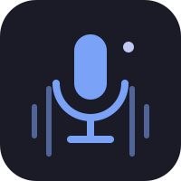

<div align="center">


# AI Interview Copilot

Real-time desktop assistant that listens to both sides of a technical interview, transcribes them concurrently, and generates context-aware, personalized answers as the interviewer speaks.

<a href="https://www.rust-lang.org/"></a>
<a href="https://tokio.rs/"></a>
<a href="https://github.com/emilk/egui"></a>
<a href="LICENSE"></a>

</div>

---

## What is this

AI Interview Copilot captures your microphone and the interviewer's audio (via system loopback) at the same time, transcribes both streams in real time, and — the moment the interviewer finishes a question — retrieves the relevant parts of your own background and drafts a full, technically grounded answer you can glance at and say out loud.

It's built as a real desktop tool: native Windows audio capture, a local voice-activity-detection model, a resilient streaming transcription pipeline, a session-aware RAG engine, and a native overlay window, running as a multi-threaded Rust application.

> **Intended use.** This project was built for interview practice and self-assessment — rehearsing answers, reviewing your own responses against what the model suggests, and getting comfortable with technical questions before the real thing. Using it to receive undisclosed real-time assistance during an actual interview, without the interviewer's knowledge, may violate the hiring company's policies and, depending on jurisdiction, wiretapping/consent-to-record laws (audio from the call is sent to third-party APIs for transcription). You are responsible for how you use this software; see [`LICENSE`](LICENSE) for the full disclaimer of warranty.

## Features

- **Real-time dual audio capture** — microphone and system audio captured and transcribed independently and concurrently via WASAPI.
- **Local voice activity detection** — Silero VAD (ONNX Runtime) runs on-device to detect speech turns; no audio leaves your machine just to figure out when someone stopped talking.
- **Streaming transcription** — Deepgram transcribes both speakers over WebSocket, with a hybrid turn-closing strategy (Deepgram's own endpoint detection as the primary signal, a bounded local fallback if it doesn't fire) for reliability.
- **Session-aware RAG** — your background is embedded once (Voyage AI) and retrieved semantically per question. Answers stay grounded in your real experience but are never limited to only what's literally stored — the model always gives a complete, technical answer and personalizes it where relevant.
- **Real conversation memory** — the last few questions and answers are replayed to the LLM as actual multi-turn chat history, not isolated one-off completions.
- **Live overlay window** — type your background once at startup, then watch the conversation transcribe live, with the AI's suggested answers visually distinguished from the rest.
- **Pause / Resume** — stop and resume audio processing instantly, from the window or the F9 hotkey.
- **Hide / Unhide** — toggles whether the window is excluded from screen capture (Windows content-protection). Hidden by default on launch.
- **Transcript export** — every turn (interviewer, candidate, and AI) is saved to `transcript.txt`.

## Screenshots


## Tech Stack

| Component | Technology |
|---|---|
| Audio capture | WASAPI (native Windows) |
| Voice activity detection | Silero VAD (ONNX Runtime, local) |
| Speech-to-text | Deepgram (streaming WebSocket, nova-2) |
| Embeddings | Voyage AI (voyage-3-lite, 512 dims) |
| Vector store | In-memory cosine similarity |
| LLM | Groq (llama-3.1-8b-instant) |
| UI | egui / eframe |
| Async runtime | Tokio |

Full architecture writeup — threading model, data flow, and every component in detail — lives in [`docs/ARCHITECTURE.md`](docs/ARCHITECTURE.md).

## Requirements

- Windows (WASAPI dependency)
- Rust toolchain (`cargo`)
- A virtual audio cable or loopback driver to capture system audio (e.g. [VB-Cable](https://vb-audio.com/Cable/))

## Setup

1. Clone the repository:
   ```bash
   git clone https://github.com/juanmas-hub/ai-interview-assistant
   cd ai-interview-assistant
   ```

2. Create a `.env` file in the project root:
   ```env
   DEEPGRAM_API_KEY=your_deepgram_key
   VOYAGE_API_KEY=your_voyage_key
   GROQ_API_KEY=your_groq_key
   ```

3. Get your API keys:
   - **Deepgram** → [console.deepgram.com](https://console.deepgram.com) (free tier available)
   - **Voyage AI** → [dash.voyageai.com](https://dash.voyageai.com) (free tier: 200M tokens/month)
   - **Groq** → [console.groq.com](https://console.groq.com) (free tier available)

4. Build and run:
   ```bash
   cargo run
   ```

## Usage

On launch, a window opens asking for your background — one idea per line, the more specific the better:

- Current role and company
- Projects you've worked on and the technologies used
- Your main tech stack
- Architecture patterns you've applied

Press **Start session** to begin. The window switches to a live view: every turn from either side of the call appears as it's transcribed, and the AI's suggested answers show up visually distinguished from the rest of the conversation.

## Controls

| Control | Action |
|---|---|
| `F9` or **Pause / Resume** button | Pause / resume audio processing |
| **Hide / Unhide** button | Toggle whether the window is excluded from screen capture |
| **Close session** button | End the session and close the window |
| `Ctrl+C` (terminal) | Force shutdown |

## Output

All conversation turns are saved to `transcript.txt` in the project root:

```
[Interviewer]: Tell me about your experience with microservices.
[AI]: Built Nexus, a ticket booking platform fully based on microservices using Go and TypeScript...
[User]: I've worked with microservices in my Nexus project...
```

## Roadmap

Ongoing and planned work — observability, reliability fixes, a possible headless RAG service split, local profile persistence, and more — is tracked in [`docs/ARCHITECTURE.md` § Possible Next Steps](docs/ARCHITECTURE.md#18-possible-next-steps).

## License

MIT — see [`LICENSE`](LICENSE).
